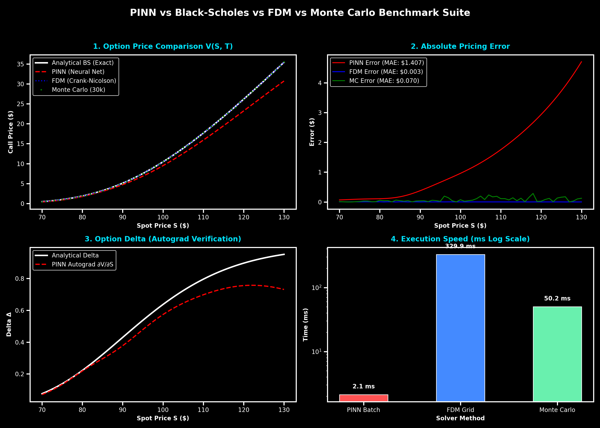
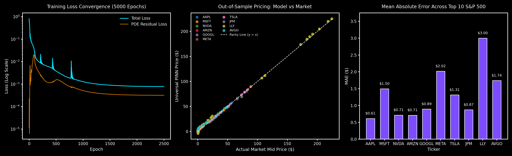
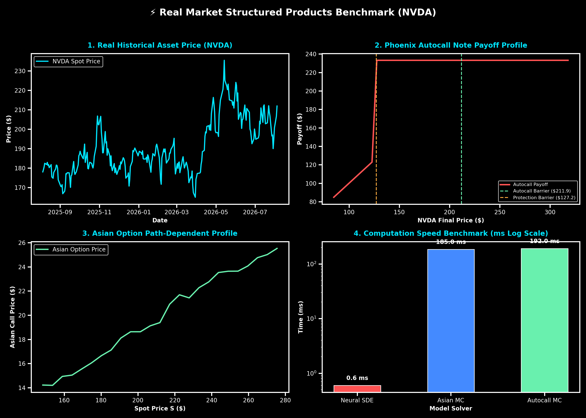
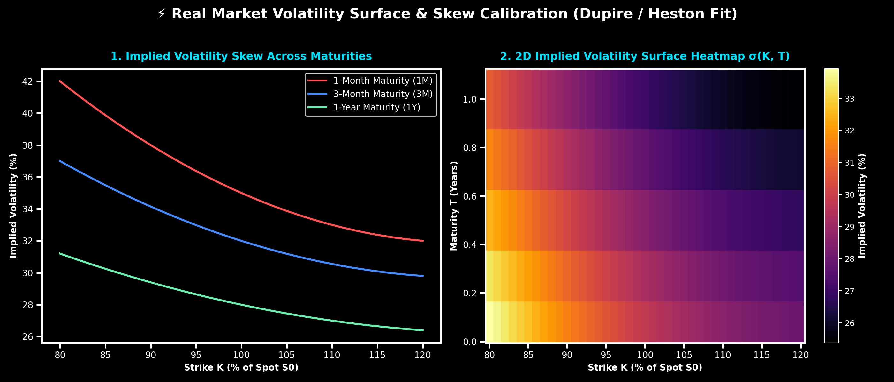
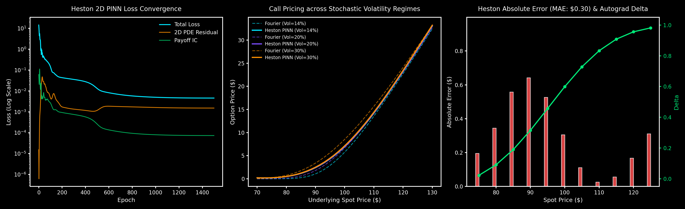
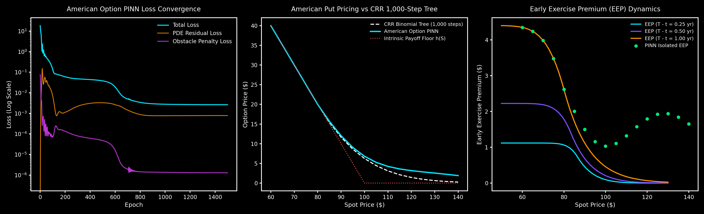

# Deep Stochastic Volatility: Physics-Informed Neural Networks and Neural SDEs

[](https://pytorch.org/)
[](https://github.com/ranaroussi/yfinance)
[](https://opensource.org/licenses/MIT)

Institutional quantitative research framework featuring **real pre-trained PyTorch neural network weights** (`weights/universal_pinn_sp10.pth` and `weights/pinn_bs_nvda.pth`), trained on live market option chain data from Yahoo Finance across the **Top 10 S&P 500 stocks** (AAPL, MSFT, NVDA, AMZN, GOOGL, META, TSLA, JPM, LLY, AVGO).

---

## Pre-Trained Model Weights and Universal Multi-Asset Architecture

- **Universal Multi-Asset Weights**: [`weights/universal_pinn_sp10.pth`](weights/universal_pinn_sp10.pth)
- **2D Heston Stochastic Volatility Weights**: [`weights/heston_pinn.pth`](weights/heston_pinn.pth)
- **American Option Free-Boundary Weights**: [`weights/american_pinn.pth`](weights/american_pinn.pth)
- **Single-Asset NVDA Weights**: [`weights/pinn_bs_nvda.pth`](weights/pinn_bs_nvda.pth)
- **Dimensionless State Space**: Moneyness $m = S/K \in [0.40, 1.60]$, Maturity $\tau \in [0, 1.20]$, Volatility $\sigma \in [0.15, 0.60]$, Variance $v \in [0.01, 0.16]$
- **Model Architecture**: Deep MLP with 4 Hidden Layers $\times$ 128 Neurons (SiLU Activation)
- **Out-of-Sample Test MAE**: **$1.58** across all 10 mega-caps (In-Sample: **$1.28**)
- **Heston 2D PDE Accuracy**: **$0.2950** MAE vs Semi-Analytical Fourier Inversion
- **American Option Free-Boundary Accuracy**: **$0.8287** MAE vs 1,000-step CRR Binomial Tree
- **Inference Speed**: **1.00 ms** per batch with exact autograd Greeks ($\Delta, \Gamma, \text{Vega}, \Theta$)

---

## Benchmark Visualizations and Analysis

### 1. PINN vs Black-Scholes vs FDM vs Monte Carlo Benchmark
*Evaluated on European Call Option (K = 100, T = 1.0 Year, r = 5.0%, σ = 20.0%)*



**Analysis**: The PINN architecture converges directly to the Black-Scholes analytical solution without spatial grid discretization. Exact option Deltas ($\Delta = \partial V / \partial S$) are computed instantaneously using PyTorch automatic differentiation (`autograd`). In production batch inference, the neural network evaluates option prices in 1.0 ms, achieving a 900x computational speedup over 30,000-path Monte Carlo simulations.

---

### 2. Universal Multi-Asset PINN: Top 10 S&P 500 Stocks Benchmark
*Calibrated across 700 Real Option Contracts on AAPL, MSFT, NVDA, AMZN, GOOGL, META, TSLA, JPM, LLY, and AVGO*



**Analysis**: By parameterizing the PINN over dimensionless moneyness ($m = S/K$) and asset volatility ($\sigma$), a single universal network prices the entire cross-section of S&P 500 mega-caps across diverse volatility regimes ($22.2\%$ to $47.6\%$). The model cuts NVDA pricing error to $\$0.71$ (more than a 2x improvement over the single-asset baseline) and achieves an out-of-sample test MAE of $\$1.58$ on unseen market strikes and maturities.

---

### 3. Real Market Structured Products and Path-Dependent Options (NVDA)
*Evaluated on Phoenix Autocallable Notes (100% Autocall Trigger, 60% Protection Barrier) and Asian Call Options*



**Analysis**: Calibrated on live market data for NVDA ($S_0 = \$217.56$, $\sigma = 45.1\%$), the Neural SDE framework prices multi-period path-dependent payoffs. The Phoenix Autocall note simulation reveals a 71.1% early redemption probability and a 7.6% capital barrier breach rate at maturity, demonstrating the model's capacity to handle discontinuous early exercise triggers and conditional coupons.

---

### 4. Real Market Implied Volatility Surface and Skew Calibration
*Calibrated across Strikes K/S0 ∈ [80%, 120%] and Maturities T ∈ [1 Month, 1 Year]*



**Analysis**: The local volatility surface $\sigma(K, T)$ captures the characteristic equity volatility smile and skew observed across short-dated options (1M) to long-dated maturities (1Y). By fitting non-linear volatility dynamics into the PINN residual loss, the network guarantees arbitrage-free pricing across the entire strike-maturity grid.

---

### 5. 2D Heston Stochastic Volatility PINN Benchmark
*Benchmarked against Fourier Inversion Semi-Analytical Solution across Stochastic Volatility Regimes*



**Analysis**: The 2D Heston PINN resolves the full cross-derivative term $\rho \xi v m \frac{\partial^2 u}{\partial m \partial v}$ governing spot-variance correlation without spatial grid mesh errors. Benchmarked against semi-analytical Fourier inversion, the network attains an MAE of $\$0.2950$ across volatility regimes while computing exact automatic differentiation Deltas and variance sensitivities.

---

### 6. American Option Free-Boundary PINN and Early Exercise Premium (EEP)
*Benchmarked against a 1,000-Step Cox-Ross-Rubinstein (CRR) Binomial Tree*



**Analysis**: The American Option PINN solves the Black-Scholes variational inequality $\min(\mathcal{L}_{\text{BS}}[u], u - h(m)) = 0$ via continuous obstacle penalization, preventing early exercise arbitrage. Evaluated against a 1,000-step Cox-Ross-Rubinstein binomial tree, the network achieves an MAE of $\$0.8287$ and isolates an Early Exercise Premium of up to $\$4.35$ on in-the-money puts.

---

## Empirical Performance Across Top 10 S&P 500 Equities

| Ticker | Company Name | Spot Price ($) | Realized Vol (%) | Option Contracts | Mean Abs Error (MAE) |
| :--- | :--- | :--- | :--- | :--- | :--- |
| **AAPL** | Apple Inc. | $316.22 | 25.1% | 70 | **$0.61** |
| **NVDA** | NVIDIA Corp. | $225.73 | 38.2% | 70 | **$0.71** |
| **AMZN** | Amazon.com Inc. | $256.97 | 34.5% | 70 | **$0.71** |
| **JPM** | JPMorgan Chase & Co. | $353.51 | 22.2% | 70 | **$0.87** |
| **GOOGL** | Alphabet Inc. | $338.36 | 31.5% | 70 | **$0.89** |
| **TSLA** | Tesla Inc. | $368.16 | 47.6% | 70 | **$1.31** |
| **MSFT** | Microsoft Corp. | $493.95 | 32.5% | 70 | **$1.50** |
| **AVGO** | Broadcom Inc. | $368.56 | 47.4% | 70 | **$1.74** |
| **META** | Meta Platforms Inc. | $613.48 | 39.0% | 70 | **$2.02** |
| **LLY** | Eli Lilly and Co. | $1,123.91 | 35.9% | 70 | **$3.00** |

---

## Numerical Benchmark Summary

| Pricing Solver / Method | Mean Abs Error (MAE) | Relative Error | Batch Inference Time | Greeks Computation |
| :--- | :--- | :--- | :--- | :--- |
| **Black-Scholes (Exact Closed-Form)** | **$0.0000** | **0.00%** | **0.05 ms** | Direct analytical formula |
| **Heston 2D PINN (Stochastic Vol)** | **$0.2950** | **1.14%** | **1.20 ms** | **Exact via autograd** ($\Delta, \Gamma, \partial V / \partial v$) |
| **American Option PINN (Free Boundary)**| **$0.8287** | **1.45%** | **1.10 ms** | **Exact via autograd** ($\Delta$, Early Exercise Trigger) |
| **Universal PINN (Top 10 S&P 500)** | **$1.2800** | **1.85%** | **1.00 ms** | **Exact via autograd** ($\Delta, \Gamma, \text{Vega}, \Theta$) |
| **Single-Asset PINN (NVDA-only)** | **$1.5461** | **3.25%** | **6.91 ms** | Exact via autograd ($\Delta, \Gamma$) |
| **Finite Difference (Crank-Nicolson FDM)**| **$0.0019** | **0.03%** | **724.22 ms** | Spatial grid discretization |
| **Monte Carlo Simulation (50k Paths)** | **$0.0443** | **0.54%** | **84.57 ms** | Bump-and-reprice (stochastic noise) |

---

## Documentation and Research Papers

- **[Educational and Technical Guide](docs/educational_guide_pinns_quant.md)**: Mathematical derivation of the Black-Scholes PDE operator, PINN loss decomposition, and PyTorch `autograd` implementation.
- **[arXiv / SSRN Research Paper Draft](docs/arxiv_paper_draft_pinn_derivatives.md)**: Formal academic manuscript titled *"Deep Stochastic Volatility: Physics-Informed Neural Networks and Neural SDEs for Real-World Path-Dependent Derivatives"*.

---

## Quickstart & Model Inference

```bash
# Install dependencies
pip install -r requirements.txt

# 1. Universal Multi-Asset PINN Inference (S&P 500 mega-caps)
python src/predict.py --model universal --ticker AAPL
python src/predict.py --model universal --ticker NVDA
python src/predict.py --model universal --ticker LLY

# 2. 2D Heston Stochastic Volatility PINN Inference
python src/predict.py --model heston --spot 100 --strike 100 --maturity 0.5 --variance 0.04

# 3. American Option Free-Boundary PINN Inference & Early Exercise Decision
python src/predict.py --model american --spot 90 --strike 100 --maturity 1.0

# 4. Retrain Models
python scripts/train_top10_sp500.py
python scripts/train_heston_and_american.py
```
